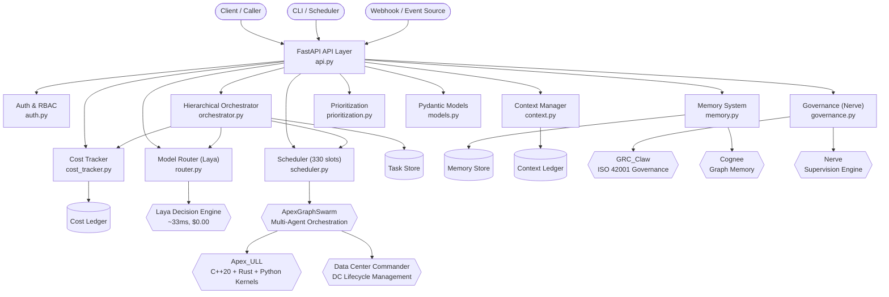
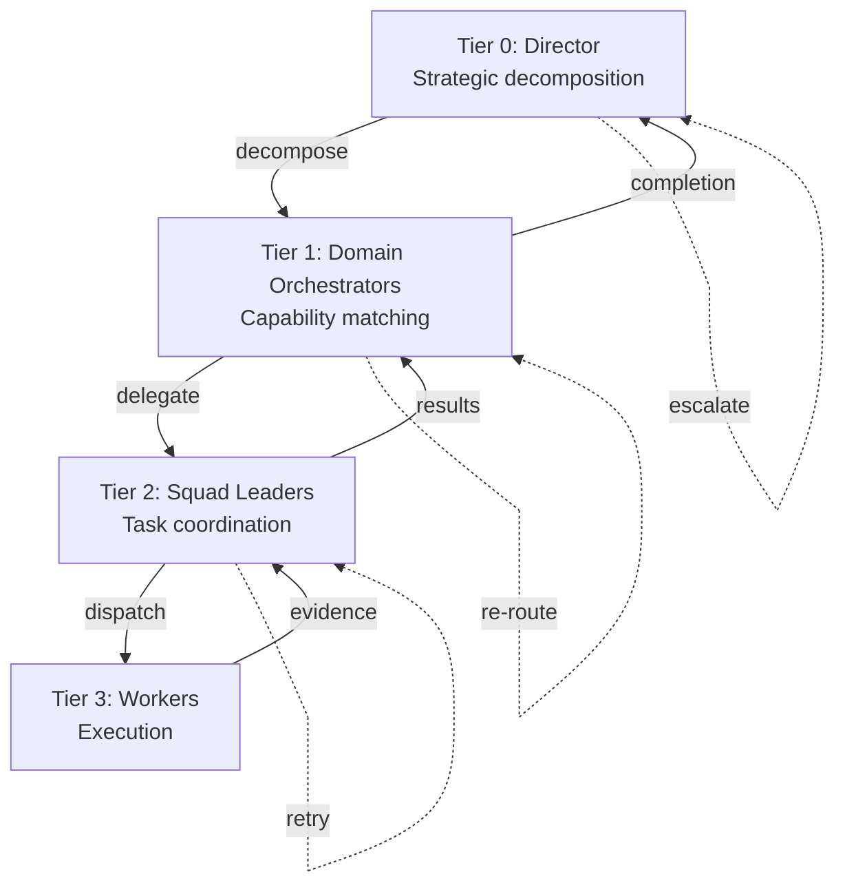
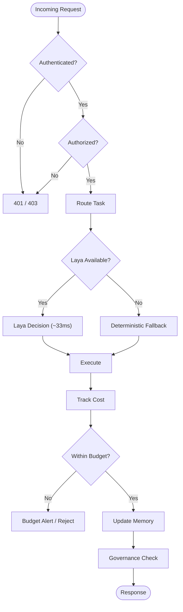

# Apex Harness

**LLM-Agnostic Harness Engineering** — Unified orchestration layer for multi-agent swarms with hierarchical delegation, cost-aware model routing, and evidence-backed completion.

Built by [Ahmed Hassan (@AAH20)](https://github.com/AAH20) as the central harness for 120+ open-source projects spanning AI infrastructure, FinTech, security, neuromorphic computing, and edge AI.

---

## Table of Contents

- [Project Overview](#project-overview)
- [Architecture](#architecture)
- [Features](#features)
- [API Reference](#api-reference)
- [Quick Start](#quick-start)
- [Ecosystem Projects](#ecosystem-projects)
- [FinTech C2 Matrix](#fintech-c2-matrix)
- [License](#license)

---

## Project Overview

Apex Harness is a production-grade orchestration framework that provides:

- **Hierarchical task delegation** across four tiers (Director → Domain Orchestrator → Squad Leader → Worker)
- **Cost-aware model routing** via Laya (~33ms local CPU decisions, $0.00 per route)
- **330 agent slots** with wave-based parallel dispatch and concurrency control
- **Cognee graph memory** with multi-strategy retrieval (semantic, keyword, graph, hybrid)
- **Nerve supervision** for Definition-of-Done enforcement and governance
- **Per-call cost tracking** with budget enforcement and alerting
- **Role-based context filtering** (CEO / Orchestrator / Cluster Leader / Worker)
- **Memory prioritization** with P0–P4 tiers and configurable eviction policies
- **FastAPI REST API** with OAuth2 + PKCE, mTLS, API keys, RBAC, and ABAC

The harness is **LLM-agnostic** — it routes tasks to the most suitable model or agent based on difficulty, domain, tool requirements, and cost constraints, not vendor lock-in.

---

## Architecture

### System Context



### Hierarchical Orchestration Flow



### Request Lifecycle



---

## Features

| Feature | Component | Description |
|---|---|---|
| Hierarchical Orchestration | `orchestrator.py` | Tier 0→1→2→3 delegation with evidence-backed completion |
| Laya Model Routing | `router.py` | ~33ms local CPU routing decisions, $0.00 per route |
| Agent Slot Management | `scheduler.py` | 330 agent slots, wave-based parallel dispatch |
| Cost Tracking | `cost_tracker.py` | Per-call token/budget tracking with hourly/daily/monthly enforcement |
| Graph Memory | `memory.py` | Cognee integration, multi-strategy retrieval (semantic/keyword/graph/hybrid) |
| Context Management | `context.py` | Role-based filtering (CEO/Orchestrator/Cluster Leader/Worker) |
| Governance | `governance.py` | Nerve supervision, DoD enforcement, audit trail |
| Memory Prioritization | `prioritization.py` | P0–P4 tiers, TTL/LRU/LFU/staleness/relevance eviction |
| Authentication | `auth.py` | API keys, OAuth2 + PKCE, mTLS, RBAC, ABAC with tenant isolation |
| REST API | `api.py` | FastAPI with 12+ endpoints, OpenAPI docs |
| Data Models | `models.py` | 30+ Pydantic models for type-safe API contracts |
| Integrations | `integrations.py` | ApexGraphSwarm, GRC_Claw, Apex_ULL, Data Center Commander |

---

## API Reference

### System

| Method | Endpoint | Description | Auth |
|---|---|---|---|
| `GET` | `/` | API info and endpoint listing | None |
| `GET` | `/health` | Health check with integration status | None |

### Routing

| Method | Endpoint | Description | Scope |
|---|---|---|---|
| `POST` | `/route` | Route a task via Laya graph-based routing | `route` |

**Request:**
```json
{
  "task": "Analyze Q3 revenue trends",
  "task_type": "analysis",
  "priority": "high",
  "context": {"domain": "finance"},
  "preferred_agent": null
}
```

**Response:**
```json
{
  "request_id": "uuid",
  "decision": {
    "agent_id": "agent-42",
    "agent_type": "data_analyst",
    "confidence": 0.92,
    "reasoning": "Task matches data analysis profile",
    "estimated_cost_usd": 0.03,
    "estimated_duration_s": 2.5
  },
  "alternatives": [],
  "timestamp": "2026-10-01T00:00:00Z"
}
```

### Execution

| Method | Endpoint | Description | Scope |
|---|---|---|---|
| `POST` | `/execute` | Execute a task (sync or async) | `execute` |
| `GET` | `/execute/{job_id}` | Get async execution status | `read` |

### Status

| Method | Endpoint | Description | Scope |
|---|---|---|---|
| `GET` | `/status` | Real-time agent status | `read` |

### Memory

| Method | Endpoint | Description | Scope |
|---|---|---|---|
| `POST` | `/memory/recall` | Semantic memory recall | `read` |
| `POST` | `/memory/remember` | Store a new memory | `write` |
| `POST` | `/memory/forget` | Delete memories by ID, query, or namespace | `write` |

### Cost

| Method | Endpoint | Description | Scope |
|---|---|---|---|
| `GET` | `/cost/report` | Cost report with breakdown by category/agent/tenant | `read` |

### Governance

| Method | Endpoint | Description | Scope |
|---|---|---|---|
| `POST` | `/governance/check` | Compliance check (ISO 42001, NIST AI RMF, EU AI Act) | `governance` |

### Auth

| Method | Endpoint | Description | Role |
|---|---|---|---|
| `POST` | `/auth/token` | OAuth2 token (client_credentials, authorization_code, refresh_token) | None |
| `POST` | `/auth/api-keys` | Create API key | `admin` |
| `GET` | `/auth/api-keys` | List API keys | `admin` |
| `DELETE` | `/auth/api-keys/{key_id}` | Revoke API key | `admin` |

---

## Quick Start

### Prerequisites

- Python 3.11+
- [uv](https://docs.astral.sh/uv/) or pip

### Install

```bash
cd ~/Downloads/apex-harness
pip install fastapi uvicorn httpx pydantic
```

### Run

```bash
cd src
uvicorn api:app --host 0.0.0.0 --port 8000 --reload
```

### Test

```bash
# Health check
curl http://localhost:8000/health

# Route a task
curl -X POST http://localhost:8000/route \
  -H "Content-Type: application/json" \
  -H "X-API-Key: your-api-key" \
  -d '{"task": "Analyze market trends", "task_type": "analysis"}'

# Execute a task
curl -X POST http://localhost:8000/execute \
  -H "Content-Type: application/json" \
  -H "X-API-Key: your-api-key" \
  -d '{"task": "Generate report", "task_type": "generation"}'
```

### API Docs

Once running, visit:
- Swagger UI: `http://localhost:8000/docs`
- ReDoc: `http://localhost:8000/redoc`

---

## Ecosystem Projects

Apex Harness is the central orchestration layer for Ahmed Hassan's (@AAH20) open-source ecosystem. All projects are available on GitHub under the [@AAH20](https://github.com/AAH20) organization.

### Core Infrastructure

| Project | Description |
|---|---|
| [ApexGraphSwarm](https://github.com/AAH20/ApexGraphSwarm) | Graph intelligence + multi-agent orchestration engine |
| [Apex_ULL](https://github.com/AAH20/Apex_ULL) | C++20 + Rust + Python kernels (106 components) |
| [GRC_Claw](https://github.com/AAH20/GRC_Claw) | ISO 42001 governance, risk, and compliance |
| [Data Center Commander](https://github.com/AAH20/Data-Center-Commander) | Data center lifecycle management |
| [Apex Memory Context](https://github.com/AAH20/Apex-Memory-Context) | Memory context management system |

### Agent & Swarm Infrastructure

| Project | Description |
|---|---|
| [hyper-agent-os](https://github.com/AAH20/hyper-agent-os) | Operating system for autonomous agents |
| [swarm-substrate](https://github.com/AAH20/swarm-substrate) | Substrate for multi-agent swarm coordination |
| [agent-immune-kernel](https://github.com/AAH20/agent-immune-kernel) | Immune system for agent self-protection |
| [agent-trust-fabric](https://github.com/AAH20/agent-trust-fabric) | Trust fabric for inter-agent verification |

### Security & Compliance

| Project | Description |
|---|---|
| [agentproof-ai-security-scanner](https://github.com/AAH20/agentproof-ai-security-scanner) | AI-powered security scanning |
| [vuln-triage](https://github.com/AAH20/vuln-triage) | Vulnerability triage and prioritization |
| [aiops-observability-platform](https://github.com/AAH20/aiops-observability-platform) | AIOps observability and monitoring |

### Cloud & Cost Optimization

| Project | Description |
|---|---|
| [ai-cloud-cost-optimization-platform](https://github.com/AAH20/ai-cloud-cost-optimization-platform) | Cloud cost optimization for AI workloads |

### Neuromorphic & Advanced Computing

| Project | Description |
|---|---|
| [neuro-manifold](https://github.com/AAH20/neuro-manifold) | Neuromorphic manifold computing |
| [neuro-spatial](https://github.com/AAH20/neuro-spatial) | Neuromorphic spatial processing |
| [pqc-enclave](https://github.com/AAH20/pqc-enclave) | Post-quantum cryptographic enclave |
| [zk-biometrics](https://github.com/AAH20/zk-biometrics) | Zero-knowledge biometric verification |

### Physical & Edge AI

| Project | Description |
|---|---|
| [cyborg-bench](https://github.com/AAH20/cyborg-bench) | Benchmarking for cybernetic systems |
| [sky-sentinel](https://github.com/AAH20/sky-sentinel) | Aerial surveillance and monitoring |
| [edge-vision-mesh](https://github.com/AAH20/edge-vision-mesh) | Edge vision processing mesh |

---

## FinTech C2 Matrix

The following 20-layer capability matrix maps the Apex Harness ecosystem to FinTech use cases. Each layer identifies the relevant projects and harness components.

| # | Layer | Capability | Harness Component | Ecosystem Projects |
|---|---|---|---|---|
| 1 | **Market Data** | Real-time market data ingestion, normalization, and distribution | `memory.py`, `context.py` | ApexGraphSwarm, Apex_ULL |
| 2 | **Order Management** | Order lifecycle management, routing, and execution | `orchestrator.py`, `scheduler.py` | ApexGraphSwarm, hyper-agent-os |
| 3 | **Risk Management** | Real-time risk scoring, exposure limits, VaR | `cost_tracker.py`, `governance.py` | GRC_Claw, agent-trust-fabric |
| 4 | **Compliance** | Regulatory compliance, audit trails, reporting | `governance.py`, `auth.py` | GRC_Claw, agentproof-ai-security-scanner |
| 5 | **Network Infrastructure** | Low-latency networking, mesh topology | `scheduler.py`, `integrations.py` | edge-vision-mesh, swarm-substrate |
| 6 | **Payments** | Payment processing, settlement, reconciliation | `orchestrator.py`, `cost_tracker.py` | Apex_ULL, ApexGraphSwarm |
| 7 | **Revenue Assurance** | Revenue leakage detection, billing assurance | `cost_tracker.py`, `prioritization.py` | ai-cloud-cost-optimization-platform |
| 8 | **Growth Analytics** | Customer segmentation, LTV prediction, churn | `memory.py`, `context.py` | Apex Memory Context, neuro-manifold |
| 9 | **Arbitrage** | Cross-venue arbitrage detection and execution | `router.py`, `scheduler.py` | Apex_ULL, ApexGraphSwarm |
| 10 | **DeFi** | DeFi protocol interaction, smart contract orchestration | `orchestrator.py`, `governance.py` | agent-trust-fabric, zk-biometrics |
| 11 | **Merchant** | Merchant onboarding, payment gateway integration | `api.py`, `auth.py` | Apex_ULL, agentproof-ai-security-scanner |
| 12 | **AI Infrastructure** | Model serving, inference optimization, GPU scheduling | `router.py`, `scheduler.py` | ApexGraphSwarm, Apex_ULL, neuro-manifold |
| 13 | **Cloud Infrastructure** | Multi-cloud orchestration, cost optimization | `integrations.py`, `cost_tracker.py` | Data Center Commander, ai-cloud-cost-optimization-platform |
| 14 | **Security** | Threat detection, vulnerability management, zero-trust | `auth.py`, `governance.py` | agentproof-ai-security-scanner, vuln-triage, agent-immune-kernel |
| 15 | **Observability** | Metrics, logging, tracing, alerting | `cost_tracker.py`, `api.py` | aiops-observability-platform |
| 16 | **Neuromorphic** | Neuromorphic computing for pattern recognition | `router.py`, `memory.py` | neuro-manifold, neuro-spatial |
| 17 | **Post-Quantum** | Post-quantum cryptography, quantum-resistant security | `auth.py`, `governance.py` | pqc-enclave, zk-biometrics |
| 18 | **Physical AI** | Robotics, cybernetic systems, physical automation | `orchestrator.py`, `scheduler.py` | cyborg-bench, sky-sentinel |
| 19 | **Edge AI** | Edge inference, federated learning, IoT intelligence | `scheduler.py`, `context.py` | edge-vision-mesh, neuro-spatial |
| 20 | **Data Infrastructure** | Data pipelines, ETL, feature stores, vector DB | `memory.py`, `context.py` | Apex Memory Context, Apex_ULL |

---

## License

```
Apex Harness — LLM-Agnostic Harness Engineering
Copyright (C) 2026 Ahmed Hassan (@AAH20)

This program is free software: you can redistribute it and/or modify
it under the terms of the GNU Affero General Public License as published
by the Free Software Foundation, either version 3 of the License, or
(at your option) any later version.

This program is distributed in the hope that it will be useful,
but WITHOUT ANY WARRANTY; without even the implied warranty of
MERCHANTABILITY or FITNESS FOR A PARTICULAR PURPOSE.  See the
GNU Affero General Public License for more details.

You should have received a copy of the GNU Affero General Public License
along with this program.  If not, see <https://www.gnu.org/licenses/agpl-3.0.txt>.
```

See [NOTICE](./NOTICE) for attribution and third-party license information.

---

**No pricing tiers. No MRR targets. No subscription details.** Interested parties are encouraged to perform their own due diligence.
